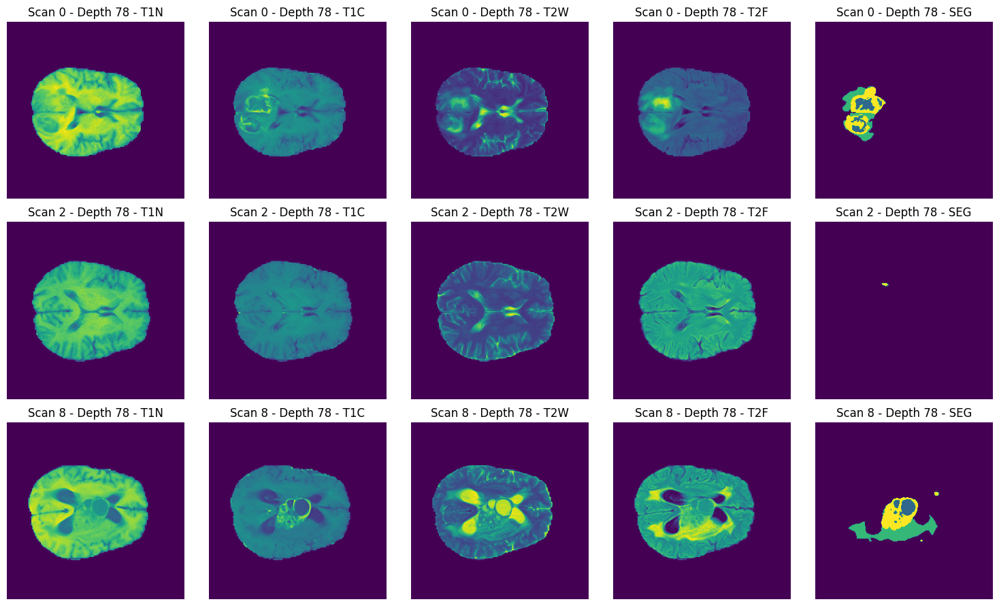

# BraTs-tryout
Practicing with different deep learning models on 3D brain tumor segmentation data.

Using BraTs 2023 data to practice training semantic segmentation models. Example MRI-slice from the (multi-class) dataset:

Models tried so far:
- Simple CNN
- U-net

Models to try next:
- SegFormer3D
- ...